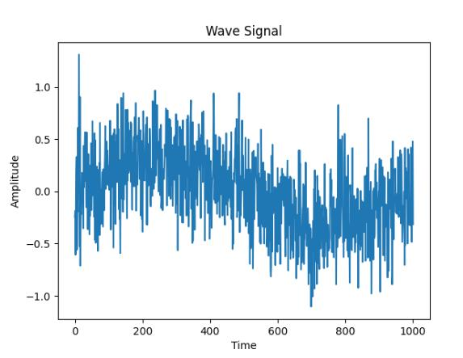
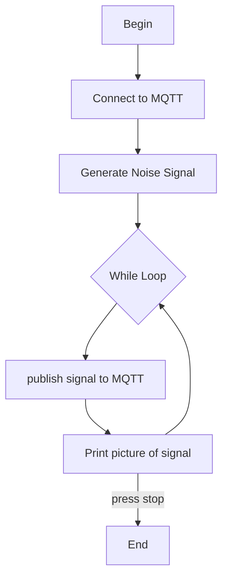

# Assignmemt1

# Signal

## Flow Chart

```mermaid
flowchart TD;
  A[Begin]-->B[Connect to MQTT]       ;
  B-->C[Generate Noise Signal]         ;
  C-->D{While Loop}         ;
  D-->F[publish signal to MQTT]         ;
  F-->G[Print picture of signal]          ;
  G-->D;
G--press stop --> H[End];


```
